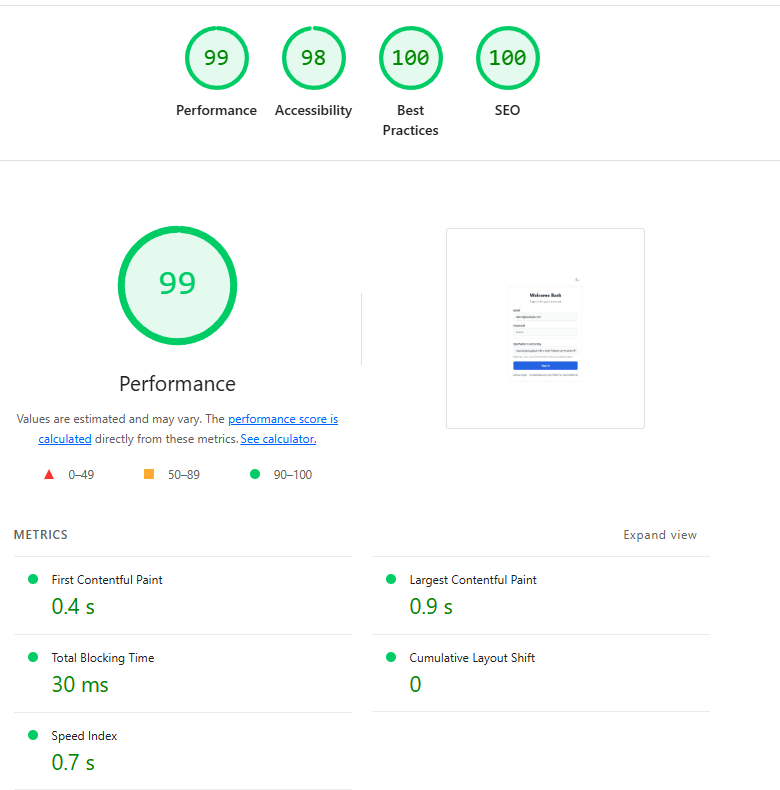

# Syncfusion Theme Studio

A high-performance, fully customizable React admin portal template with visual theme editor. Built with React 18, Vite, TypeScript, Tailwind CSS, and Syncfusion components.

- local dev http://localhost:4444/
- local production http://localhost:4446/dashboard

Login page light house result for production build 



- [Syncfusion Theme Studio](#syncfusion-theme-studio)
  - [Performance Highlights](#performance-highlights)
  - [Features](#features)
  - [Tech Stack](#tech-stack)
  - [Quick Start](#quick-start)
  - [Project Structure](#project-structure)
  - [Theme Customization](#theme-customization)
    - [Export/Import Themes](#exportimport-themes)
  - [API Integration](#api-integration)
  - [Code Standards](#code-standards)
  - [Performance Optimization Details](#performance-optimization-details)
    - [The Problem](#the-problem)
    - [Root Causes Identified](#root-causes-identified)
    - [Solution 1: Dynamic Imports for Syncfusion License](#solution-1-dynamic-imports-for-syncfusion-license)
    - [Solution 2: Split UI Component Barrels](#solution-2-split-ui-component-barrels)
    - [Solution 3: Native HTML Components for Login](#solution-3-native-html-components-for-login)
    - [Solution 4: Lazy-Load MainLayout](#solution-4-lazy-load-mainlayout)
    - [Solution 5: CSS Code Splitting](#solution-5-css-code-splitting)
    - [Solution 6: Remove Syncfusion Grid from Modulepreload](#solution-6-remove-syncfusion-grid-from-modulepreload)
    - [Solution 7: Background Preloading After Login](#solution-7-background-preloading-after-login)
    - [Solution 8: Optimize Vite Dev Server](#solution-8-optimize-vite-dev-server)
    - [Bundle Analysis](#bundle-analysis)
    - [Performance Testing](#performance-testing)
  - [CSS Customization System](#css-customization-system)
    - [CSS Architecture](#css-architecture)
    - [CSS Layers](#css-layers)
    - [Theme Variables](#theme-variables)
    - [Per-Component Theming](#per-component-theming)
    - [Theme Presets](#theme-presets)
    - [Using Presets](#using-presets)
    - [Export/Import Themes](#exportimport-themes-1)
    - [Syncfusion Component Styling](#syncfusion-component-styling)
  - [Related Projects](#related-projects)
    - [Integration Points](#integration-points)
  - [License](#license)
  - [Contributing](#contributing)


## Performance Highlights

| Metric | Score |
|--------|-------|
| **Lighthouse Performance** | 98/100 |
| **First Contentful Paint** | 1.8s |
| **Largest Contentful Paint** | 2.0s |
| **Total Blocking Time** | 0ms |
| **Cumulative Layout Shift** | 0 |
| **Initial JS Bundle** | ~116 KB |
| **Initial CSS Bundle** | ~6 KB |

## Features

- **Visual Theme Editor** - Real-time theme customization with live preview
- **100% CSS Variables** - All styling driven by CSS variables for runtime editing
- **Per-Component Theming** - Each component has its own light/dark theme configuration
- **12+ Theme Presets** - Beautiful pre-built themes with light/dark variants
- **Dark/Light Mode** - Full theme support with smooth transitions
- **Syncfusion Components** - Enterprise-grade UI components with custom wrappers
- **Type-Safe API Hooks** - Auto-generated with Orval from OpenAPI specs
- **Internationalization** - Built-in i18next support
- **Lazy Loading** - Optimized bundle splitting for fast initial load
- **Strict TypeScript** - Enterprise-grade type safety
- **Comprehensive Testing** - Unit tests (Vitest) and E2E tests (Playwright)

## Tech Stack

| Technology | Purpose |
|------------|---------|
| React 18 | UI Framework |
| Vite 5 | Build Tool |
| TypeScript 5 | Type Safety |
| Tailwind CSS 3 | Utility-First Styling |
| Syncfusion | Enterprise UI Components |
| TanStack Query | Server State Management |
| Zustand | Client State Management |
| React Router 6 | Routing |
| i18next | Internationalization |
| Orval | API Hook Generation |
| Vitest | Unit Testing |
| Playwright | E2E Testing |

## Quick Start

```bash
# Tilt
tilt up --port=10351

# Install dependencies
npm install

# Start development server
npm run dev

# Build for production
npm run build

# Run tests
npm run test
```

## Project Structure

```
src/
├── app/                    # Application shell
│   ├── App.tsx
│   ├── routes.tsx
│   └── providers/
├── components/
│   ├── layout/             # MainLayout, Sidebar, Header
│   ├── ui/                 # Syncfusion wrappers
│   └── common/             # Shared components
├── features/
│   ├── auth/               # Login page
│   ├── dashboard/          # Home page
│   ├── pets/               # Demo API integration
│   ├── showcase/           # Component showcase
│   └── theme-editor/       # Visual theme customization
├── api/                    # Orval-generated hooks
├── stores/                 # Zustand stores
├── localization/           # i18n setup
├── styles/                 # CSS layers and themes
└── utils/                  # Utility functions
```

## Theme Customization

The theme editor allows real-time customization of:

- **Primary Colors** - Full color scale (50-900)
- **Status Colors** - Success, warning, error, info
- **Layout** - Sidebar width, header height
- **Border Radius** - Component roundness
- **Typography** - Font families and sizes
- **Transitions** - Animation timing

All changes are applied instantly without page reload and persist across sessions.

### Export/Import Themes

```typescript
// Export current theme
const themeJson = exportTheme();

// Import custom theme
importTheme(customThemeJson);
```

## API Integration

This template uses the [Swagger Petstore API](https://petstore3.swagger.io/) for demonstration. API hooks are auto-generated using Orval.

```bash
# Regenerate API hooks after OpenAPI spec changes
npm run orval
```

## Code Standards

- [Code Standards Hub](./docs/code-standards/README.md) - Index of all standards
- [Styling Architecture Guide](./docs/code-standards/styling-architecture.md) - CSS layers, theme injection, customization guide
- [Forms Architecture Guide](./docs/code-standards/forms-architecture.md) - React Hook Form + Zod, field adapters, validation patterns

This project follows strict coding standards:

- ESLint with TypeScript strict rules
- Maximum file length: 300 lines
- Maximum function length: 50 lines
- No magic numbers
- Comprehensive accessibility support
- Unit test coverage > 80%

## Common Functionality & References

### Tailwind CSS Spacing Scale

Used for padding (`p-`), margin (`m-`), width (`w-`), height (`h-`), gap, etc.

| Class suffix | CSS value | Pixels |
|-------------|-----------|--------|
| `0` | `0px` | 0 |
| `px` | `1px` | 1 |
| `0.5` | `0.125rem` | 2 |
| `1` | `0.25rem` | 4 |
| `1.5` | `0.375rem` | 6 |
| `2` | `0.5rem` | 8 |
| `2.5` | `0.625rem` | 10 |
| `3` | `0.75rem` | 12 |
| `4` | `1rem` | 16 |
| `5` | `1.25rem` | 20 |
| `6` | `1.5rem` | 24 |
| `8` | `2rem` | 32 |
| `[3px]` | `3px` | Arbitrary value syntax |

**Direction prefixes:** `t` (top), `b` (bottom), `l` (left), `r` (right), `x` (horizontal), `y` (vertical), none (all sides).

Example: `pt-2` = `padding-top: 0.5rem` (8px), `mx-4` = `margin-left: 1rem; margin-right: 1rem` (16px).

Full reference: https://tailwindcss.com/docs/padding

### Where to Find Things

| What | Location |
|------|----------|
| **Shared UI components** | `src/components/ui/shared/` (SearchInput, etc.) |
| **Layout components** | `src/components/layout/` (Sidebar, Header, MainLayout) |
| **Theme store & types** | `src/stores/theme/` |
| **Theme presets** | `src/stores/theme/presets/` |
| **Default component styles** | `src/stores/theme/defaults/` (light & dark) |
| **CSS variable injection** | `src/stores/theme/injectors/` |
| **Theme settings UI editors** | `src/components/layout/ThemeSettingsDrawer/sections/ComponentsSection/` |
| **CSS layers & component styles** | `src/styles/layers/` |
| **Localization strings** | `src/localization/locales/en.json` |
| **Syncfusion wrappers** | `src/components/ui/` (DataGrid, Select, DatePicker, etc.) |
| **Feature pages** | `src/features/` (auth, dashboard, showcase, etc.) |
| **API hooks (Orval-generated)** | `src/api/` |
| **Utility functions** | `src/utils/` (cn, is, etc.) |

---

## Performance Optimization Details

This project underwent extensive performance optimization to achieve a **98/100 Lighthouse score**. Below are the detailed fixes and techniques implemented.

### The Problem

The initial implementation had severe performance issues:

| Metric | Before | After | Improvement |
|--------|--------|-------|-------------|
| Lighthouse Score | 54/100 | 98/100 | +44 points |
| First Contentful Paint | 32.2s | 1.8s | **18x faster** |
| Largest Contentful Paint | 62.4s | 2.0s | **31x faster** |
| Initial JS Bundle | ~2.5 MB | ~116 KB | **95% smaller** |
| Total Blocking Time | 120ms | 0ms | **Perfect** |

### Root Causes Identified

1. **Syncfusion Grid Loading on Login Page** - The 2.1MB Syncfusion Grid component was loading on every page, including the login page where it wasn't needed.

2. **Static Imports of Heavy Dependencies** - The `registerLicense` function from `@syncfusion/ej2-base` was imported statically, pulling in the entire Syncfusion dependency tree.

3. **Barrel Export Tree-Shaking Issues** - The main UI component barrel (`@/components/ui/index.ts`) mixed native and Syncfusion components, causing bundlers to include all Syncfusion code.

4. **Eager CSS Loading** - All Syncfusion CSS was loaded upfront instead of being code-split.

5. **MainLayout Not Lazy-Loaded** - The dashboard layout and all its dependencies loaded on every page.

### Solution 1: Dynamic Imports for Syncfusion License

**Problem:** Static import of `registerLicense` pulled in all Syncfusion dependencies.

**Before:**
```typescript
// src/config/syncfusion.ts
import { registerLicense } from '@syncfusion/ej2-base';

export function initializeSyncfusion(): void {
  registerLicense(DEFAULT_LICENSE_KEY);
}
```

**After:**
```typescript
// src/config/syncfusion.ts
async function registerLicenseAsync(key: string): Promise<void> {
  const { registerLicense } = await import('@syncfusion/ej2-base');
  registerLicense(key);
}

export function initializeSyncfusion(): void {
  registerLicenseAsync(DEFAULT_LICENSE_KEY).catch(() => undefined);
}
```

**Impact:** Removed ~2MB from initial bundle by deferring Syncfusion base library loading.

### Solution 2: Split UI Component Barrels

**Problem:** Importing any component from the main barrel loaded all Syncfusion dependencies.

**Solution:** Created separate barrel exports for native and Syncfusion components:

```
src/components/ui/
├── index.ts        → Re-exports types only (backward compatible)
├── native.ts       → ButtonNative, InputNative (zero Syncfusion deps)
└── syncfusion.ts   → DataGrid, Button, Input, Select, etc.
```

**Login Page Import (Before):**
```typescript
import { Button, Input } from '@/components/ui';  // Loaded ALL components
```

**Login Page Import (After):**
```typescript
import { ButtonNative, InputNative } from '@/components/ui/native';  // Zero Syncfusion
```

**Impact:** Login page no longer loads any Syncfusion JavaScript.

### Solution 3: Native HTML Components for Login

**Problem:** Login page used Syncfusion Button and Input components unnecessarily.

**Solution:** Created lightweight native HTML components:

```typescript
// src/components/ui/ButtonNative/index.tsx
const ButtonNative = ({ children, variant, ...props }) => (
  <button className={`btn btn-${variant}`} {...props}>
    {children}
  </button>
);

// src/components/ui/InputNative/index.tsx
const InputNative = ({ label, error, ...props }) => (
  <div className="input-wrapper">
    <label>{label}</label>
    <input className="input" {...props} />
    {error && <span className="error">{error}</span>}
  </div>
);
```

**Impact:** Login page uses only ~2KB of component code instead of ~200KB.

### Solution 4: Lazy-Load MainLayout

**Problem:** MainLayout and all its dependencies (Sidebar, Header, ThemeSettingsDrawer) loaded on every page.

**Before:**
```typescript
// src/app/routes.tsx
import { MainLayout } from '@/components/layout/MainLayout';

const routes = [
  { path: '/dashboard', element: <MainLayout /> }
];
```

**After:**
```typescript
// src/app/routes.tsx
const MainLayout = lazy(async () => ({
  default: (await import('@/components/layout/MainLayout')).MainLayout,
}));

const routes = [
  {
    path: '/dashboard',
    element: (
      <Suspense fallback={<LoadingSpinner />}>
        <MainLayout />
      </Suspense>
    )
  }
];
```

**Impact:** Dashboard layout code only loads when navigating to `/dashboard`.

### Solution 5: CSS Code Splitting

**Problem:** All CSS (including Syncfusion styles) loaded on initial page load.

**Solution:** Split CSS into login-specific and app-specific files:

```
src/styles/
├── login.css       → Base styles + critical components only (~6KB gzipped)
├── app.css         → Syncfusion styles + full components (~140KB gzipped)
└── layers/
    ├── base.css
    ├── components-critical.css  → btn, card, input only
    └── components-app.css       → sidebar, header, badges, modals
```

**Login Page:**
```typescript
// src/main.tsx
import './styles/login.css';  // Only critical CSS
```

**Dashboard (loaded dynamically):**
```typescript
// src/components/layout/MainLayout/index.tsx
useEffect(() => {
  import('@/styles/app.css');  // Full CSS loaded after login
}, []);
```

**Impact:** Initial CSS reduced from ~150KB to ~6KB.

### Solution 6: Remove Syncfusion Grid from Modulepreload

**Problem:** Vite's modulepreload was including the 2.1MB Syncfusion Grid chunk.

**Solution:** Post-build script to strip heavy chunks from modulepreload:

```javascript
// scripts/add-prefetch-hints.js
const REMOVE_FROM_MODULEPRELOAD = ['syncfusion-grid'];

for (const chunkName of REMOVE_FROM_MODULEPRELOAD) {
  const regex = new RegExp(
    `\\s*<link[^>]*rel="modulepreload"[^>]*href="[^"]*${chunkName}[^"]*"[^>]*>`,
    'g'
  );
  html = html.replace(regex, '\n');
}
```

**Also configured in Vite:**
```typescript
// vite.config.ts
build: {
  modulePreload: {
    resolveDependencies: (_filename, deps) => {
      return deps.filter((dep) => !dep.includes('syncfusion-grid'));
    },
  },
}
```

**Impact:** Browser no longer preloads the 2.1MB grid chunk on login.

### Solution 7: Background Preloading After Login

**Problem:** Dashboard felt slow because Syncfusion modules loaded on navigation.

**Solution:** Preload modules in background after successful login:

```typescript
// src/config/syncfusionLazy.ts
export const preloadSyncfusionModules = (): void => {
  const preload = (): void => {
    import('@syncfusion/ej2-react-grids').catch(() => undefined);
    import('@syncfusion/ej2-react-calendars').catch(() => undefined);
    import('@syncfusion/ej2-react-dropdowns').catch(() => undefined);
  };

  if ('requestIdleCallback' in window)
    window.requestIdleCallback(preload, { timeout: 2000 });
  else
    setTimeout(preload, 100);
};

// Called on login form submit
const handleSubmit = () => {
  preloadSyncfusionModules();  // Start loading in background
  navigate('/dashboard');
};
```

**Impact:** Dashboard loads instantly because modules are already cached.

### Solution 8: Optimize Vite Dev Server

**Problem:** Development server had 9.1s FCP due to on-demand transforms.

**Solution:** Pre-bundle all heavy dependencies:

```typescript
// vite.config.ts
optimizeDeps: {
  include: [
    'react', 'react-dom', 'react-dom/client',
    'react-router-dom', '@tanstack/react-query', 'zustand',
    'i18next', 'react-i18next',
    '@syncfusion/ej2-base',
    '@syncfusion/ej2-react-grids',
    '@syncfusion/ej2-react-inputs',
    '@syncfusion/ej2-react-buttons',
    // ... all Syncfusion packages
  ],
  esbuildOptions: {
    target: 'es2020',
    keepNames: true,
  },
},
server: {
  warmup: {
    clientFiles: [
      './src/main.tsx',
      './src/app/App.tsx',
      './src/app/routes.tsx',
      './src/features/auth/pages/LoginPage/index.tsx',
    ],
  },
},
```

**Impact:** Dev server starts faster and HMR is more responsive.

### Bundle Analysis

**Final Production Bundle (Login Page):**

| File | Size (gzipped) | Purpose |
|------|----------------|---------|
| `index-*.js` | 27.7 KB | Main app entry |
| `react-vendor-*.js` | 66.1 KB | React + React DOM |
| `query-vendor-*.js` | 13.5 KB | TanStack Query |
| `index-*.css` | 6.4 KB | Login CSS |
| **Total** | **~116 KB** | Initial load |

**Deferred Chunks (loaded after login):**

| File | Size (gzipped) | When Loaded |
|------|----------------|-------------|
| `syncfusion-grid-*.js` | 498 KB | DataGrid pages |
| `syncfusion-inputs-*.js` | 1.4 KB | Form pages |
| `app-*.css` | 140 KB | Dashboard |

### Performance Testing

Always test performance using the **production build**:

```bash
# Build for production
npm run build

# Start preview server (port 4173)
npm run preview

# Run Lighthouse
npx lighthouse http://localhost:4173 --view
```

**Note:** The dev server (port 4444/4445) will always be slower because code isn't minified. Only use production builds for accurate performance metrics.

### Module Preloading Strategy

To maintain fast initial load while ensuring smooth dashboard experience, we use strategic background preloading.

#### What to Preload and Where

| Module | When to Preload | Location | Why |
|--------|-----------------|----------|-----|
| **Syncfusion Components** | On login submit | LoginPage | Dashboard needs them immediately |
| **Form Libraries** (react-hook-form, zod) | After login page loads | LoginPage useEffect | Forms used throughout dashboard |
| **App CSS** | On dashboard mount | MainLayout | Full styling for dashboard |
| **Syncfusion Grid** | On dashboard idle | MainLayout | Heavy, load when browser is idle |

#### Implementation Locations

```typescript
// 1. Login Page - Preload Syncfusion on submit
// src/features/auth/pages/LoginPage/index.tsx
import { preloadSyncfusionModules } from '@/config/syncfusionLazy';
import { preloadFormLibraries } from '@/config/preloadForms';

function LoginPage() {
  // Preload form libraries when login page mounts
  useEffect(() => {
    preloadFormLibraries();
  }, []);

  const handleSubmit = () => {
    preloadSyncfusionModules(); // Start loading before navigation
    navigate('/dashboard');
  };
}

// 2. MainLayout - Preload remaining heavy modules
// src/components/layout/MainLayout/index.tsx
import { preloadSyncfusionFormComponents } from '@/config/preloadForms';

function MainLayout() {
  useEffect(() => {
    import('@/styles/app.css'); // Load full CSS
    preloadSyncfusionFormComponents(); // Form-specific Syncfusion
  }, []);
}
```

#### Preload Configuration Files

```typescript
// src/config/preloadForms.ts
export function preloadFormLibraries(): void {
  const preload = (): void => {
    import('react-hook-form').catch(() => undefined);
    import('zod').catch(() => undefined);
    import('@hookform/resolvers/zod').catch(() => undefined);
  };

  if ('requestIdleCallback' in window) {
    window.requestIdleCallback(preload, { timeout: 3000 });
  } else {
    setTimeout(preload, 1000);
  }
}

export function preloadSyncfusionFormComponents(): void {
  const preload = (): void => {
    import('@syncfusion/ej2-react-inputs').catch(() => undefined);
    import('@syncfusion/ej2-react-dropdowns').catch(() => undefined);
    import('@syncfusion/ej2-react-calendars').catch(() => undefined);
  };

  if ('requestIdleCallback' in window) {
    window.requestIdleCallback(preload, { timeout: 3000 });
  } else {
    setTimeout(preload, 1000);
  }
}
```

#### Preloading Best Practices

1. **Use `requestIdleCallback`** - Only preload when browser is idle
2. **Set timeout** - Ensure preload happens even if browser never idles
3. **Catch errors** - Silent failure for preloads (non-critical)
4. **Don't block** - Preloading should never delay user interactions
5. **Order matters** - Preload modules in order of likely use

---

## CSS Customization System

This project implements a comprehensive CSS customization system using CSS variables, layers, and dynamic injection.

### CSS Architecture

```
src/styles/
├── login.css                    # Entry point for login page
├── app.css                      # Entry point for dashboard (lazy-loaded)
└── layers/
    ├── base.css                 # CSS reset, variables, theme tokens
    ├── components.css           # Full component library
    ├── components-critical.css  # Minimal components for login
    ├── components-app.css       # Additional dashboard components
    └── syncfusion-overrides.css # Syncfusion theme integration
```

### CSS Layers

CSS layers are used for specificity control:

```css
@layer base, components, utilities;
```

This ensures:
1. **base** - Theme variables and resets (lowest specificity)
2. **components** - Component styles
3. **utilities** - Tailwind utilities (highest specificity)

### Theme Variables

All styling is driven by CSS variables for runtime customization:

```css
:root {
  /* Primary Colors */
  --color-primary-50: 239 246 255;
  --color-primary-500: 59 130 246;
  --color-primary-900: 30 58 138;

  /* Component-Specific Variables */
  --button-bg: var(--color-primary-500);
  --button-text: 255 255 255;
  --button-border-radius: var(--radius-md);

  --input-bg: var(--color-surface);
  --input-border: var(--color-border);
  --input-focus-ring: var(--color-primary-500);

  /* Layout Variables */
  --sidebar-width: 256px;
  --header-height: 64px;
}
```

### Per-Component Theming

Each component has its own light and dark theme configuration:

```typescript
// src/stores/theme/types/componentTypes.ts
interface ComponentsConfig {
  light: ComponentConfigSingle;
  dark: ComponentConfigSingle;
}

interface ComponentConfigSingle {
  button: ButtonConfig;
  input: InputConfig;
  select: SelectConfig;
  dataGrid: DataGridConfig;
  datePicker: DatePickerConfig;
  dialog: DialogConfig;
}
```

Components automatically use the correct theme based on current mode:

```typescript
// src/stores/theme/injectors/componentInjector.ts
export function injectComponentVariables(
  components: ComponentsConfig,
  mode: 'light' | 'dark'
): void {
  const config = components[mode];

  // Inject button variables
  setVar('--button-bg', config.button.background);
  setVar('--button-text', config.button.textColor);

  // Inject input variables
  setVar('--input-bg', config.input.background);
  setVar('--input-border', config.input.borderColor);
  // ... etc
}
```

### Theme Presets

12 beautiful theme presets are included, each with light and dark variants:

| Preset | Description |
|--------|-------------|
| Ocean Blue | Professional blue (Salesforce-inspired) |
| Forest Green | Nature-inspired with amber accents |
| Royal Purple | Elegant with rose gold secondary |
| Sunset Orange | Warm coral and orange tones |
| Rose Pink | Soft pink with lavender accent |
| Midnight | Deep dark blue with electric violet |
| Arctic | Cool ice blue, clean and refreshing |
| Copper | Warm metallic with bronze accents |
| Emerald | Rich jewel-toned green |
| Lavender | Soft calming purple tones |
| Slate | Professional gray |
| Gold | Luxurious with bronze accents |

### Using Presets

```typescript
import { useThemeStore } from '@/stores/useThemeStore';
import { oceanBluePreset } from '@/stores/theme/presets';

const { applyPreset } = useThemeStore();

// Apply a preset
applyPreset(oceanBluePreset);
```

### Export/Import Themes

```typescript
const { exportTheme, importTheme } = useThemeStore();

// Export current theme as JSON
const themeJson = exportTheme();
console.log(JSON.stringify(themeJson, null, 2));

// Import a theme
importTheme(customThemeJson);
```

### Syncfusion Component Styling

Syncfusion components are styled using CSS variable overrides:

```css
/* src/styles/layers/syncfusion-overrides.css */

/* Button Overrides */
.e-btn {
  background-color: rgb(var(--button-bg));
  color: rgb(var(--button-text));
  border-radius: var(--button-border-radius);
}

/* Input Overrides */
.e-input-group {
  background-color: rgb(var(--input-bg));
  border-color: rgb(var(--input-border));
}

.e-input-group:focus-within {
  border-color: rgb(var(--input-focus-ring));
  box-shadow: 0 0 0 3px rgb(var(--input-focus-ring) / 0.1);
}

/* DataGrid Overrides */
.e-grid {
  background-color: rgb(var(--datagrid-bg));
  border-color: rgb(var(--datagrid-border));
}

.e-grid .e-headercell {
  background-color: rgb(var(--datagrid-header-bg));
  color: rgb(var(--datagrid-header-text));
}
```

---

## Related Projects

This theme studio is designed to work with the broader SaaS platform:

| Project | Description | Location |
|---------|-------------|----------|
| **BaseClient** | React Native/Expo frontend | `../BaseClient` |
| **IdentityService** | Authentication & authorization | `../IdentityService` |
| **QuestionerService** | Survey/questionnaire service | `../QuestionerService` |
| **OnlineMenuService** | Restaurant menu management | `../OnlineMenuSaaS/OnlineMenuService` |
| **NotificationService** | Push notifications & alerts | `../NotificationService` |
| **E2ETests** | Playwright end-to-end tests | `../E2ETests` |

### Integration Points

1. **Theme Export** - Export themes as JSON for use in other frontends
2. **CSS Variables** - Generated variables can be imported into any project
3. **Component Wrappers** - Syncfusion wrappers are reusable across projects
4. **Design Tokens** - Export design tokens for design system consistency

---

## License

MIT License - see [LICENSE](LICENSE) for details.

## Contributing

Contributions are welcome! Please read our contributing guidelines before submitting a PR.

1. Fork the repository
2. Create your feature branch (`git checkout -b feature/amazing-feature`)
3. Commit your changes (`git commit -m 'Add amazing feature'`)
4. Push to the branch (`git push origin feature/amazing-feature`)
5. Open a Pull Request
