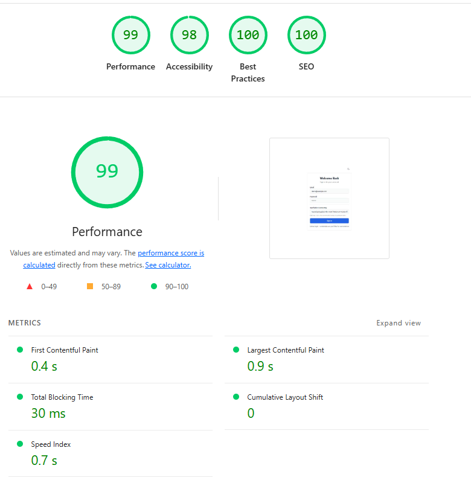

# Syncfusion Theme Studio

A high-performance, fully customizable React admin portal template with visual theme editor. Built with React 18, Vite, TypeScript, Tailwind CSS, and Syncfusion components.

- local dev http://localhost:4444/
- local production http://localhost:4445/

Login page light house result for production build



- [Syncfusion Theme Studio](#syncfusion-theme-studio)
  - [Performance Highlights](#performance-highlights)
  - [Features](#features)
  - [Tech Stack](#tech-stack)
  - [Quick Start](#quick-start)
  - [Environment Setup](#environment-setup)
    - [Syncfusion License Key (Required)](#syncfusion-license-key-required)
    - [Figma-to-Theme Sync (Optional)](#figma-to-theme-sync-optional)
    - [Feature Flags (Page Section Gating)](#feature-flags-page-section-gating)
    - [Files Not in Git (Generated / Local-Only)](#files-not-in-git-generated--local-only)
    - [All Commands](#all-commands)
  - [Project Structure](#project-structure)
  - [Theme Customization](#theme-customization)
    - [Export/Import Themes](#exportimport-themes)
  - [API Integration](#api-integration)
  - [Code Standards](#code-standards)
    - [Module Structure Convention](#module-structure-convention)
  - [Developer Guides](#developer-guides)
  - [Icons](#icons)
  - [Figma Integration](#figma-integration)
    - [Two Theme Paths](#two-theme-paths)
    - [Three-Phase Pipeline](#three-phase-pipeline)
    - [Full Sync](#full-sync)
    - [Figma API Setup](#figma-api-setup)
    - [Mapping Configuration](#mapping-configuration)
    - [Script Files](#script-files)
    - [Commands](#commands)
    - [Adding a New Section](#adding-a-new-section)
    - [Section Readiness Tracker](#section-readiness-tracker)
    - [Icons from Figma](#icons-from-figma)
  - [Local Development Pipeline](#local-development-pipeline)
  - [Common Functionality \& References](#common-functionality--references)
    - [Tailwind CSS Spacing Scale](#tailwind-css-spacing-scale)
    - [Where to Find Things](#where-to-find-things)
  - [Performance Optimization Details](#performance-optimization-details)
  - [CSS Customization System](#css-customization-system)
  - [Live Demo](#live-demo)
  - [Integration Points](#integration-points)
  - [License](#license)
  - [Contributing](#contributing)


## Performance Highlights

| Metric | Score |
|--------|-------|
| **Lighthouse Performance** | 98/100 |
| **First Contentful Paint** | 1.8s |
| **Largest Contentful Paint** | 2.0s |
| **Total Blocking Time** | 0ms |
| **Cumulative Layout Shift** | 0 |
| **Initial JS Bundle** | ~116 KB |
| **Initial CSS Bundle** | ~6 KB |

## Features

- **Visual Theme Editor** - Real-time theme customization with live preview
- **100% CSS Variables** - All styling driven by CSS variables for runtime editing
- **Per-Component Theming** - Each component has its own light/dark theme configuration
- **12+ Theme Presets** - Beautiful pre-built themes with light/dark variants
- **Dark/Light Mode** - Full theme support with smooth transitions
- **Syncfusion Components** - Enterprise-grade UI components with custom wrappers
- **Type-Safe API Hooks** - Auto-generated with Orval from OpenAPI specs
- **Internationalization** - Built-in i18next support
- **Lazy Loading** - Optimized bundle splitting for fast initial load
- **Strict TypeScript** - Enterprise-grade type safety
- **Comprehensive Testing** - Unit tests (Vitest) and E2E tests (Playwright)

## Tech Stack

| Technology | Purpose |
|------------|---------|
| React 18 | UI Framework |
| Vite 7 | Build Tool |
| TypeScript 5 | Type Safety |
| Tailwind CSS 3 | Utility-First Styling |
| Syncfusion | Enterprise UI Components |
| TanStack Query | Server State Management |
| Zustand | Client State Management |
| React Router 7 | Routing |
| i18next | Internationalization |
| Orval | API Hook Generation |
| Vitest | Unit Testing |
| Playwright | E2E Testing |

## Quick Start

```bash
# 1. Install dependencies
npm install

# 2. Set up environment variables (see Environment Setup below)
cp .env.example .env

# 3. Generate API hooks (required — these are gitignored)
npm run api:generate

# 4. Start development server
npm run dev

# 5. Open http://localhost:4444 and log in with demo credentials
```

> **Note:** `src/api/generated/` is gitignored and must be regenerated after cloning.
> Without this step, pages that use API hooks (Products, Forms) will fail to compile.

> **Memory:** The `.npmrc` file sets `node-options=--max-old-space-size=16384` (16 GB heap) because the Syncfusion dependency tree is very large. This is required for `npm run build` and `npm run lint` to complete without running out of memory. The file is committed to the repo — no action needed after cloning.

## Environment Setup

Copy `.env.example` to `.env` and configure the required variables:

```bash
cp .env.example .env
```

### Syncfusion License Key (Required)

```env
VITE_SYNCFUSION_LICENSE_KEY=your-license-key-here
```

A valid Syncfusion license key is **required** to suppress trial watermark banners on Syncfusion components (DataGrid, DatePicker, etc.). Without it the app runs normally but displays license warnings.

Get your key from the [Syncfusion License Portal](https://www.syncfusion.com/account/manage-trials/downloads) under "License & Downloads" > "Get License Key".

### Figma-to-Theme Sync (Optional)

```env
FIGMA_API_TOKEN=your-figma-personal-access-token
FIGMA_FILE_KEY=your-figma-file-key
```

These variables enable the Figma-to-Theme sync pipeline (`npm run figma:sync`) which extracts design tokens from a Figma file and generates a theme preset. **This is entirely optional** — the app runs fully without Figma credentials. Only configure these if you want to sync themes from Figma.

Generate a Figma personal access token at **Figma > Settings > Personal access tokens**.

### Feature Flags (Page Section Gating)

Feature flags disable entire page sections at build time, removing them from the production bundle via Vite's static `import.meta.env` replacement + Rollup dead-code elimination.

| Env Var | Default | Gates |
|---------|---------|-------|
| `VITE_ENABLE_THEME_STUDIO` | `true` | Theme settings sidebar and cog toggle button |
| `VITE_ENABLE_COMPONENTS` | `true` | ~46 component showcases + overview + grid |
| `VITE_ENABLE_FORMS` | `true` | SyncfusionFormsPage, NativeFormsPage |
| `VITE_ENABLE_PRODUCTS` | `true` | NativeProductsPage, ProductsListPage |

**To disable a section**, set the env var to `false` in `.env`:

```env
VITE_ENABLE_COMPONENTS=false
```

**Tilt resources without Theme Studio:**
- `theme-studio-dev-pure` (port 4446) — all flags off, mock server backend
- `theme-studio-dev-real` (port 4447) — all flags off, real backend (configure `VITE_BACKEND_URL` in the Tiltfile)

Both override the flags to `false` regardless of `.env`. All three dev servers auto-start on `tilt up` and run simultaneously on different ports.

When a section is disabled:
- Its page chunks are excluded from the production bundle (tree-shaken)
- Its sidebar nav item is hidden
- Its routes are removed (direct URL falls through to dashboard)
- The preloader skips its imports

**Two-layer gating architecture:**

1. **Build-time** (`lazyPages.ts`): Uses `import.meta.env` directly so Vite replaces the env value at build time, enabling Rollup to eliminate dead `lazy()` imports. This is the only file allowed to use `import.meta.env` directly.

2. **Runtime** (`router.tsx`, `componentShowcaseRoutes.tsx`, `sidebarNavData.ts`, `preloadOrchestrator.ts`): Uses `ENV` from `@/config/env` to conditionally include routes, nav items, and preload targets.

ESLint enforces this separation:
- `import.meta.env` is blocked everywhere except `env.ts` and `lazyPages.ts`
- `ENV` import is blocked inside `lazyPages.ts`

**Adding a new feature flag:**

1. Add `VITE_ENABLE_X=true` to `.env` and `.env.example`
2. Add the type to `src/vite-env.d.ts`
3. Add `enableX` to `ENV` in `src/config/env.ts`
4. Gate lazy imports in `src/app/routes/lazyPages.ts` using `import.meta.env` directly
5. Gate routes in `router.tsx` / showcase routes using `ENV.enableX`
6. Add the nav item `id` to `SECTION_GATES` in `sidebarNavData.ts`
7. Gate preload imports in `preloadOrchestrator.ts`

### Files Not in Git (Generated / Local-Only)

These files are required to run the project but are **gitignored**. They must be created or generated locally after cloning:

| File / Directory | Purpose | How to Create |
|------------------|---------|---------------|
| `.env` | Syncfusion license key, optional Figma tokens | `cp .env.example .env` and fill in values |
| `node_modules/` | npm dependencies | `npm install` |
| `src/api/generated/` | Orval-generated React Query hooks and TypeScript types | `npm run api:generate` |
| `dev-dist/` | PWA service worker files (VitePWA) | Auto-generated by `npm run dev` |
| `dist/` | Production build output | `npm run build` |
| `coverage/` | Unit test coverage reports | `npm run test:coverage` |
| `playwright-report/` | E2E test reports | `npm run test:e2e` |
| `reports/` | Lighthouse audit reports | `npm run lighthouse:prod` |

**Critical for compilation:** `.env` and `src/api/generated/` — without these, the app will not build. The remaining items are generated on demand.

### All Commands

```bash
# Development
npm run dev                # Start dev server (port 4444)
npm run build              # Production build
npm run preview            # Preview production build (port 4445)
npm run test               # Run unit tests
npm run test:coverage      # Run tests with coverage
npm run lint               # Lint check
npm run lint:fix           # Auto-fix lint issues

# Figma sync (optional, requires FIGMA_* env vars)
npm run figma:sync         # Extract + generate theme from Figma
npm run figma:discover     # List available Figma styles

# Tilt (optional orchestrator)
tilt up --port=10351       # Start all services via Tilt
```

## Project Structure

```
src/
├── app/                    # Application shell
│   ├── App.tsx
│   ├── routes.tsx
│   └── providers/
├── components/
│   ├── icons/              # Centralized SVG icons (see Icons section)
│   ├── layout/             # MainLayout, Sidebar, Header
│   ├── ui/                 # Syncfusion wrappers
│   └── common/             # Shared components
├── features/
│   ├── auth/               # Login page
│   ├── dashboard/          # Home page
│   ├── pets/               # Demo API integration
│   ├── showcase/           # Component showcase
│   └── theme-editor/       # Visual theme customization
├── api/                    # Orval-generated hooks
├── stores/                 # Zustand stores
├── localization/           # i18n setup
├── styles/                 # CSS layers and themes
└── utils/                  # Utility functions
```

## Theme Customization

The theme editor allows real-time customization of:

- **Primary Colors** - Full color scale (50-900)
- **Status Colors** - Success, warning, error, info
- **Layout** - Sidebar width, header height
- **Border Radius** - Component roundness
- **Typography** - Font families and sizes
- **Transitions** - Animation timing

All changes are applied instantly without page reload and persist across sessions.

### Export/Import Themes

```typescript
// Export current theme
const themeJson = exportTheme();

// Import custom theme
importTheme(customThemeJson);
```

## API Integration

API hooks are auto-generated using [Orval](https://orval.dev/) from OpenAPI specs. After any API contract change, run:

```bash
npm run api:generate
```

All Axios interceptors (`src/lib/api/interceptors/`) handle auth headers, logging, response normalization (success toasts for POST/PUT/DELETE), and error classification. 401 responses automatically redirect to login; 403 with `FEATURE_GATED` opens an upgrade modal; all other errors show appropriate notifications.

**[Full API Integration guide →](./docs/API_INTEGRATION.md)** — interceptor pipeline, 401 redirect chain design decisions, 403 handling, error registry schema.

See also: **[Adding an API Spec & Generating Hooks →](./docs/CREATE_API_SPEC_GUIDE.md)** — how to write an OpenAPI spec and wire up Orval hooks before the real backend exists.

---

## Code Standards

- [Code Standards Hub](./docs/code-standards/README.md) - Index of all standards
- [Styling Architecture Guide](./docs/code-standards/styling-architecture.md) - CSS layers, theme injection, customization guide
- [Forms Architecture Guide](./docs/code-standards/forms-architecture.md) - React Hook Form + Zod, field adapters, validation patterns

This project follows strict coding standards:

- ESLint with TypeScript strict rules
- Maximum file length: 300 lines
- Maximum function length: 50 lines
- No magic numbers
- Comprehensive accessibility support
- Unit test coverage > 80%

### Module Structure Convention

When a component or feature directory grows beyond 3 source files, its internal files must be organized into standard subdirectories. Two custom ESLint rules enforce this: `enforce-module-structure` and `enforce-test-colocation`.

**Component directory structure** (for directories with 4+ non-test source files):

```
ComponentName/
├── index.tsx              # Main component (entry point, public API)
├── types.ts               # Component-specific types
├── constants.ts           # Component-specific constants
├── components/            # Sub-components (child .tsx files)
│   ├── SubComponentA.tsx
│   └── SubComponentB.tsx
├── hooks/                 # Custom hooks
│   ├── useXxx.ts
│   └── useXxx.test.ts     # Co-located test
└── utils/                 # Pure helper functions
    ├── someHelper.ts
    └── someHelper.test.ts  # Co-located test
```

**Feature page structure:**

```
PageName/
├── index.tsx              # Page component
├── types.ts               # Page-level types
├── constants.ts           # Page-level constants
├── sections/              # Page sections (.tsx files live here directly)
│   ├── index.ts           # Barrel export
│   └── SectionName.tsx
├── components/            # Page-specific sub-components
├── hooks/                 # Page-specific hooks
├── data/                  # Static/mock data files
│   └── gridData.ts
└── utils/                 # Page-specific helpers
```

**File placement rules:**

| File Type | Naming Pattern | Required Location |
|-----------|---------------|-------------------|
| Hooks | `use*.ts` | `hooks/` subdirectory |
| Sub-components | `PascalCase.tsx` | `components/` subdirectory (or domain subdir like `filters/`, `columnMenu/`) |
| Helpers/utils | `camelCase.ts` | `utils/` subdirectory |
| Data/fixtures | `*Data.ts`, `*.data.ts` | `data/` subdirectory (in features) |
| Types | `types.ts`, `*Types.ts` | Root of component/page directory |
| Constants | `constants.ts` | Root of component/page directory |
| Tests | `*.test.ts(x)` | Co-located next to source file (NOT in `__tests__/`) |
| Schema (forms) | `schema.ts` | Root of form directory |
| Columns (grids) | `columns.ts` | Root of section directory |

**Exempt directories** (flat by design, no reorganization needed): `shared/`, `presets/`, `defaults/`, `injectors/`.

**Exempt section patterns**: `.tsx` files inside `sections/` and `forms/` directories are the primary content and stay at that level. Only hooks, utils, and data files in those directories need subdirectories.

**Threshold**: Directories with 3 or fewer source files are not subject to these rules.

---

## Developer Guides

Step-by-step guides for common development tasks:

| Guide | Description |
|-------|-------------|
| **[Create a New Feature](./docs/CREATE_NEW_FEATURE_GUIDE.md)** | Add a top-level feature page (routing, sidebar nav, lazy loading, translations, test IDs, preloading) |
| **[Create a New Shared Component](./docs/CREATE_NEW_COMPONENT_GUIDE.md)** | Add a native UI component (component, types, CSS classes, theme variables, injector, barrel export, unit tests) |
| **[Add an API Spec & Generate Hooks](./docs/CREATE_API_SPEC_GUIDE.md)** | Write an OpenAPI spec and generate type-safe React Query hooks before the backend is ready |
| **[Add a Component Showcase](./docs/ADDING_NEW_FEATURE.md)** | Add a component to the existing Components showcase section |
| **[API Integration & Error Handling](./docs/API_INTEGRATION.md)** | Interceptor pipeline, 401/403 handling, error registry |
| **[CSS Architecture](./docs/CSS_ARCHITECTURE.md)** | Layer order, code-splitting, CSS variable categories |
| **[CSS Customization](./docs/CSS_CUSTOMIZATION.md)** | Theme variables, per-component theming, presets, Syncfusion styling |
| **[Icons](./docs/ICONS.md)** | Icon file breakdown, generation script, naming rules |
| **[Local Development Pipeline](./docs/LOCAL_DEVELOPMENT_PIPELINE.md)** | All Tilt resources, MockServer workflow, mock service generation |
| **[Performance Optimization](./docs/PERFORMANCE_OPTIMIZATION.md)** | 8 optimization solutions, bundle analysis, preloading strategy |
| **[Component Package Extraction](./docs/COMPONENT_PACKAGE_EXTRACTION.md)** | Extracting native/Syncfusion components into standalone npm packages |
| **[Figma Section Generators](./docs/FIGMA_SECTION_GENERATORS.md)** | Adding new Figma-to-theme section generators |
| **[Theme Customization Plan](./docs/THEME_CUSTOMIZATION_PLAN.md)** | Roadmap and design decisions for the theme system |

---

## Icons

All reusable SVG icons live in `src/components/icons/`, organized for natural Vite code-splitting. **Total: 357 icon components** (28 app icons, 19 settings icons, 22 showcase icons, 270 Feather icons, 17 custom icons).

Import from the barrel: `import { IconDashboard } from '@/components/icons'`. New icons always go in `src/components/icons/` — never inline SVGs in feature files (enforced by the ESLint `no-inline-svg-icons` rule).

**[Full Icons reference →](./docs/ICONS.md)** — file breakdown by loading time, generation script, naming rules, and stateful component exceptions.

---

## Figma Integration

The project includes an optional Figma-to-Theme sync pipeline that extracts design tokens from the Figma API and applies them to the **Figma Design** preset theme only. All other preset themes (Fremen, Voyager, ThemeStudio, etc.) are manually authored and are not affected by this pipeline.

The app works with or without Figma data. When the pipeline has not been run, the Figma Design preset falls back to defaults.

### Two Theme Paths

There are 18 preset themes. Each is a complete `ThemeConfig`. They follow two distinct paths:

**Path 1 — Hand-Authored Presets (17 themes)**

```
Hand-authored TypeScript file (e.g. fremen.ts, themeStudio.ts)
    │  Defines: primary/secondary/neutral scales,
    │  status colors, light/dark mode overrides.
    │  Components: DEFAULT_COMPONENTS (no component-level overrides)
    │
    v
PresetsSection.handleApplyPreset()
    │
    ├── 1. generateDerivedColors(primary)
    │      Computes interactive colors (hover, active, focus)
    │      from the primary color scale
    │
    ├── 2. buildDerivedComponents(DEFAULT_COMPONENTS, derived)
    │      Patches buttons, sidebar, inputs, dataGrid
    │      with primary-derived colors at runtime
    │
    └── 3. updateTheme({...preset, components})
           │
           v
    useThemeStore (Zustand)
           │
           v
    injectThemeVariables()
           │
           v
    CSS custom properties on :root
           │
           ├──> BadgeNative     (uses DEFAULT badge colors — no preset override)
           ├──> Buttons         (uses primary-derived colors from buildDerivedComponents)
           ├──> Sidebar         (uses primary-derived colors from buildDerivedComponents)
           └──> Every other component...
```

These presets are written by hand in `src/stores/theme/presets/`. Each file defines color scales, status colors, and light/dark mode overrides. They rely on `DEFAULT_COMPONENTS` for all component-level styling — the `buildDerivedComponents()` step at runtime patches buttons, sidebar, inputs, and dataGrid with colors derived from the primary scale. Badge colors, typography, and other component sections use the default values unchanged.

**Path 2 — Figma Design Preset (1 theme, generated)**

```
Figma REST API
    │
    v
figma:extract              data/figma-extract.json        (1 API call, stores everything)
    │
    v
figma:generate:badges      data/figma-sections/badges.json (per-section intermediate)
figma:generate:buttons     data/figma-sections/buttons.json (future)
    ...
    │
    v
figma:generate             1. reads extract + ALL section JSONs
                           2. deep-merges figma-corrections/*.json on top
                           3. writes ONE src/stores/theme/presets/figmaDesign.ts
    │
    v
PresetsSection.handleApplyPreset()
    │
    ├── 1. generateDerivedColors(primary)
    ├── 2. buildDerivedComponents(FIGMA_COMPONENTS, derived)
    │      Same runtime patching, but starts from FIGMA_COMPONENTS
    │      which already has Figma overrides baked in for synced sections
    └── 3. updateTheme({...preset, components})
           │
           v
    useThemeStore (Zustand)  →  injectThemeVariables()  →  CSS custom properties
           │
           ├──> BadgeNative     (uses FIGMA badge colors — Figma-synced section)
           ├──> AlertBadge      (uses FIGMA typography — Figma-synced section)
           ├──> Buttons         (uses primary-derived + any future Figma overrides)
           └──> Every other component...
```

The generated `figmaDesign.ts` spreads `DEFAULT_COMPONENTS_LIGHT`/`DEFAULT_COMPONENTS_DARK` and only overrides the sections that have a corresponding `data/figma-sections/<name>.json` file. Unsynced sections keep their default values. Post-processing corrections from `data/figma-corrections/` are deep-merged on top to fix any incorrect Figma API values.

**Both paths converge at the same runtime steps**: `handleApplyPreset()` calls `generateDerivedColors()` then `buildDerivedComponents()` then `updateTheme()`. The Zustand store injects CSS variables, and both Native and Syncfusion components read the same CSS vars — so they always look identical regardless of which path produced the theme.

**Key difference**: hand-authored presets start from `DEFAULT_COMPONENTS` (all default badge/card/modal colors), while the Figma preset starts from `FIGMA_COMPONENTS` (with Figma-extracted overrides for synced sections like badges and alertBadges).

| Preset | Source | Figma-synced? |
|--------|--------|:---:|
| Fremen | `presets/fremen.ts` | No |
| Oceanus | `presets/oceanus.ts` | No |
| ThemeStudio | `presets/themeStudio.ts` | No |
| Default Blue | `defaultTheme.ts` | No |
| Voyager, Ocean Blue, Forest Green, ... | `presets/*.ts` | No |
| **Figma Design** | **`presets/figmaDesign.ts`** | **Yes** |

### Three-Phase Pipeline

**Phase 1: Extract** (`npm run figma:extract`)

- Makes one API call to the Figma REST API
- Walks the document tree for each section (badges, buttons, etc.)
- Stores raw extracted data in `data/figma-extract.json`
- This is the only step that requires network access and `FIGMA_API_TOKEN`

**Phase 2: Section Generators** (`npm run figma:generate:<section>`)

Each section has its own dedicated generator script that:
1. Reads `data/figma-extract.json` (no API call)
2. Maps Figma labels/nodes to theme variant keys
3. Writes an intermediate JSON to `data/figma-sections/<section>.json`

Section generators are independent. You can run one without running the others.

| Section | Script | Status |
|---------|--------|--------|
| Badges | `generate-badges.ts` | Implemented |
| Typography | `generate-typography.ts` | Implemented |
| Colours | stub | Future |
| Buttons | stub | Future |
| Input | stub | Future |
| (21 more) | stub | Future |

**Phase 3: Main Generator** (`npm run figma:generate`)

- Reads `data/figma-extract.json` for general color/mode mappings
- Reads ALL `data/figma-sections/*.json` files (auto-discovered)
- Deep-merges any `data/figma-corrections/*.json` files on top (corrections win)
- Combines everything into one `figmaDesign.ts` preset
- Component section JSONs become inline overrides in the `FIGMA_COMPONENTS` constant

### Full Sync

`npm run figma:sync` runs all three phases in order:

```
extract  -->  generate:badges  -->  generate
```

### Figma API Setup

Two environment variables are required (both in `.env`):

| Variable | Source | Example |
|----------|--------|---------|
| `FIGMA_API_TOKEN` | Figma > Settings > Personal access tokens | `figd_abc123...` |
| `FIGMA_FILE_KEY` | The file ID from the Figma URL (`figma.com/file/<KEY>/...`) | `AbCdEf12345` |

Both are optional. Without them, the `figma:*` commands will exit with a helpful message and no other functionality is affected.

### Mapping Configuration

`scripts/figma/figma-mapping.ts` defines how Figma node paths map to `ThemeConfig` properties. It supports:

- **Shared mappings** — applied to both light and dark themes (e.g., border radii, font families)
- **Separate light/dark mappings** — different Figma nodes for each mode (e.g., background colors, text colors)

Edit this file to add or change which Figma styles map to which theme properties.

### Script Files

```
scripts/figma/
  extract.ts                    Phase 1: Figma API -> JSON
  generate-badges.ts            Phase 2: Badges section generator
  corrections.ts                Deep-merges correction files onto sections
  generate.ts                   Phase 3: Combines sections -> figmaDesign.ts
  code-generators.ts            TypeScript code generation helpers
  figma-mapping.ts              Color/mode mapping rules (manual config)
  types.ts                      Shared TypeScript types
  utils.ts                      Color conversion and tree traversal utilities
  discover.ts                   Exploration tool for Figma file structure
  data/
    figma-extract.json          Raw API extraction output
    figma-sections/
      badges.json               Badge section overrides (generated)
      alertBadges.json          Alert badge section overrides (generated)
      buttons.json              (future)
      ...
    figma-corrections/
      badges.json               Fixes light mode badge text colors
```

For the full pipeline documentation including badge extraction details, correction system, and CSS variable injection flow, see [`scripts/figma/README.md`](scripts/figma/README.md).

### Commands

| Command | Description |
|---------|-------------|
| `npm run figma:extract` | Fetch Figma file and save raw extraction JSON |
| `npm run figma:generate:badges` | Generate badge section overrides from extraction |
| `npm run figma:generate` | Combine all sections into `figmaDesign.ts` |
| `npm run figma:sync` | Full pipeline: extract + all generators + combine |
| `npm run figma:discover` | Explore Figma file structure (development tool) |

### Adding a New Section

To implement a new section generator (e.g., buttons):

1. **Create `generate-buttons.ts`** that reads `figma-extract.json`, maps Figma values to theme keys, writes `data/figma-sections/buttons.json`
2. **Update extraction** in `extract.ts` if the section needs new node parsing logic
3. **Replace the stub** in `package.json`: change `"figma:generate:buttons": "echo [STUB]..."` to `"figma:generate:buttons": "tsx scripts/figma/generate-buttons.ts"`
4. **Update `figma:sync`** to include the new generator in the pipeline chain
5. **Run `figma:generate`** which automatically picks up `buttons.json` and adds it to `figmaDesign.ts`

The main generator discovers section files automatically from `data/figma-sections/*.json`.

### Section Readiness Tracker

| Category | Section | Ready Design | Variables Defined | Generation Script | App Integration |
|----------|---------|:---:|:---:|:---:|:---:|
| Foundation | **Typography** | **Yes** | **-** | **generate-typography.ts** | **Yes** |
| Foundation | Colours | Yes | - | stub | - |
| Foundation | Layouts / Grid | Review | - | stub | - |
| Foundation | Icons | - | - | stub | - |
| Components | **Badges** | **Yes** | **Yes** | **generate-badges.ts** | **Yes** |
| Components | Buttons | Yes | - | stub | - |
| Components | Description | Yes | - | stub | - |
| Components | Input | Yes | - | stub | - |
| Components | External Link | Yes | - | stub | - |
| Components | Notifications / Alerts | Future | - | stub | - |
| Components | Image | Yes | - | script | - |
| Components | Navigation Menus | - | - | stub | - |
| Components | Drop Down Lists | - | - | stub | - |
| Components | Breadcrumbs | Yes | - | script | - |
| Components | Data Grid | - | - | stub | - |
| Components | Combobox | - | - | stub | - |
| Components | Filtering / Search | - | - | stub | - |
| Components | Pagination | - | - | stub | - |
| Components | Progress | - | - | stub | - |
| Components | Skeleton | - | - | stub | - |
| Components | Slider | - | - | stub | - |
| Components | Subhead | - | - | stub | - |

### Icons from Figma

The Figma design file (the same one linked via `FIGMA_FILE_KEY`) also contains the icon reference — a complete Feather Icons set plus custom media icons. The icon SVGs in the codebase were generated to match the Figma design's icon page.

The `scripts/generate-feather-icons.mjs` script uses the `feather-icons` npm package rather than the Figma API for icon generation, since Feather icons are standardized and the npm package is the canonical source. See [Icons](./docs/ICONS.md) for the generation script details.

---

## Local Development Pipeline

[Tilt](https://tilt.dev/) orchestrates the entire development workflow — lint gates, unit tests, dev servers, production builds, E2E tests, Lighthouse audits, API codegen, and Figma sync — all with enforced dependency ordering and a live dashboard UI.

```bash
tilt up                    # Start everything (Tilt dashboard at http://localhost:10351)
```

**Startup order:** `lint → unit tests → dev servers` (each gate must pass before the next starts).

| Port | Server | Features | Auto-Start |
|------|--------|----------|:---:|
| **4444** | Dev | All features, mock backend | Yes |
| **4445** | Prod preview | All features, mock backend | No |
| **4446** | Dev (pure) | No Theme Studio, mock backend | Yes |
| **4447** | Dev (real) | No Theme Studio, real backend | Yes |
| **5150** | MockServer | .NET mock API ([Swagger UI](http://localhost:5150/swagger)) | No |
| **10351** | Tilt dashboard | — | Yes |

**[Full pipeline reference →](./docs/LOCAL_DEVELOPMENT_PIPELINE.md)** — all Tilt resources with commands and descriptions, MockServer workflow, mock service generation from external OpenAPI specs.

---

## Common Functionality & References

### Tailwind CSS Spacing Scale

Used for padding (`p-`), margin (`m-`), width (`w-`), height (`h-`), gap, etc.

| Class suffix | CSS value | Pixels |
|-------------|-----------|--------|
| `0` | `0px` | 0 |
| `px` | `1px` | 1 |
| `0.5` | `0.125rem` | 2 |
| `1` | `0.25rem` | 4 |
| `1.5` | `0.375rem` | 6 |
| `2` | `0.5rem` | 8 |
| `2.5` | `0.625rem` | 10 |
| `3` | `0.75rem` | 12 |
| `4` | `1rem` | 16 |
| `5` | `1.25rem` | 20 |
| `6` | `1.5rem` | 24 |
| `8` | `2rem` | 32 |
| `[3px]` | `3px` | Arbitrary value syntax |

**Direction prefixes:** `t` (top), `b` (bottom), `l` (left), `r` (right), `x` (horizontal), `y` (vertical), none (all sides).

Example: `pt-2` = `padding-top: 0.5rem` (8px), `mx-4` = `margin-left: 1rem; margin-right: 1rem` (16px).

Full reference: https://tailwindcss.com/docs/padding

### Where to Find Things

| What | Location |
|------|----------|
| **SVG Icons** | `src/components/icons/` (AppIcons, SettingsIcons, ShowcaseIcons, FeatherIcons*, CustomIcons) |
| **Figma sync pipeline** | `scripts/figma/` (discover, extract, generate, corrections, mapping) — see [`scripts/figma/README.md`](scripts/figma/README.md) |
| **Icon generation** | `scripts/generate-feather-icons.mjs` |
| **Tilt pipeline** | `Tiltfile` (all resources, dependency order, port mappings) |
| **Mock API server** | `MockServer/` (.NET mock for standalone frontend development) |
| **Shared UI components** | `src/components/ui/shared/` (SearchInput, etc.) |
| **Layout components** | `src/components/layout/` (Sidebar, Header, MainLayout) |
| **Theme store & types** | `src/stores/theme/` |
| **Theme presets** | `src/stores/theme/presets/` |
| **Default component styles** | `src/stores/theme/defaults/` (light & dark) |
| **CSS variable injection** | `src/stores/theme/injectors/` |
| **Theme settings UI editors** | `src/components/layout/ThemeSettingsDrawer/sections/ComponentsSection/` |
| **CSS layers & component styles** | `src/styles/layers/` |
| **Localization strings** | `src/localization/locales/en.json` |
| **Syncfusion wrappers** | `src/components/ui/` (DataGrid, Select, DatePicker, etc.) |
| **Feature pages** | `src/features/` (auth, dashboard, showcase, etc.) |
| **API hooks (Orval-generated)** | `src/api/` |
| **Utility functions** | `src/utils/` (cn, is, etc.) |

---

## Performance Optimization Details

This project underwent extensive optimization to achieve a **98/100 Lighthouse score** (up from 54/100), cutting First Contentful Paint from 32.2s → 1.8s and the initial JS bundle from ~2.5 MB → ~116 KB.

**[Full optimization guide →](./docs/PERFORMANCE_OPTIMIZATION.md)** — 8 specific solutions (dynamic Syncfusion license imports, split barrels, lazy MainLayout, CSS code-splitting, modulepreload removal, background preloading after login, dev server warmup), plus bundle analysis tables and module preloading strategy.

---

## CSS Customization System

This project implements a comprehensive CSS customization system where every visual property is driven by CSS custom properties that the theme engine injects at runtime — enabling real-time theme customization without page reload.

- **[CSS Architecture →](./docs/CSS_ARCHITECTURE.md)** — Layer order (`base → syncfusion-base → components → syncfusion-overrides → utilities`), code-splitting strategy, CSS variable categories, and Syncfusion override patterns
- **[CSS Customization →](./docs/CSS_CUSTOMIZATION.md)** — File structure, theme variables reference, per-component theming, presets, and Syncfusion component styling examples

**Quick summary:** Styles are in `src/styles/layers/`. The theme store (`src/stores/theme/`) injects CSS variables at runtime via `injectThemeVariables()`. 12+ presets included, each with light and dark variants. Export/import themes as JSON via `useThemeStore()`.

---

## Live Demo

A public demo is hosted at [syncfusion-theme-studio.dloizides.com](https://syncfusion-theme-studio.dloizides.com/). Log in with `demo@example.com` / `demo123` (or any of the pre-filled quick-login buttons). The demo is backed by a public .NET 9 mock API — OpenAPI/Swagger: [syncfusion-theme-studio-mock-api.dloizides.com/swagger](https://syncfusion-theme-studio-mock-api.dloizides.com/swagger/index.html).

## Integration Points

- **Theme Export** — export themes as JSON for use in other frontends
- **CSS Variables** — generated variables can be imported into any project
- **Component Wrappers** — Syncfusion wrappers are reusable across projects
- **Design Tokens** — export design tokens for design system consistency

---

## License

MIT License - see [LICENSE](LICENSE) for details.

## Contributing

Contributions are welcome! Please read our contributing guidelines before submitting a PR.

1. Fork the repository
2. Create your feature branch (`git checkout -b feature/amazing-feature`)
3. Commit your changes (`git commit -m 'Add amazing feature'`)
4. Push to the branch (`git push origin feature/amazing-feature`)
5. Open a Pull Request
